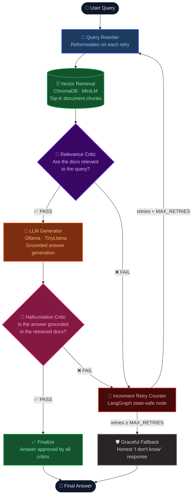

# 🧠 Self-Healing RAG Pipeline

> **A production-grade RAG system that thinks, critiques itself, detects hallucinations, and self-corrects — entirely on your local machine. No API keys. No cloud costs. No data leaves your device.**

---

## 🔍 What Problem Does It Solve?

Standard RAG pipelines are **fragile and blind**:

- They retrieve documents and generate answers — but never check if the answer is grounded in what was retrieved
- If retrieval returns irrelevant chunks, the LLM hallucinates confidently
- There's no retry mechanism — one bad retrieval = one bad answer, permanently
- They require cloud LLMs — expensive, privacy-invasive, and rate-limited

**Self-Healing RAG fixes all of this:**

| Problem | How It's Fixed |
|---|---|
| 🤥 LLM hallucinates | Hallucination critic grades every answer before it reaches the user |
| 📭 Bad retrieval | Relevance critic rejects irrelevant docs and triggers a query rewrite |
| 🔁 No retry logic | LangGraph loops back up to 3× with progressively better queries |
| ☁️ Cloud dependency | Runs 100% locally via Ollama — zero cost, zero privacy risk |
| 💀 Silent failures | Graceful fallback message instead of a broken/empty response |

---

## 🏗️ Architecture



---

## 🛠️ Tech Stack

| Component | Technology | Why |
|---|---|---|
| 🔗 Orchestration | LangGraph | Stateful cyclical graph — enables retry loops |
| 🤖 LLM | Ollama · `tinyllama` | 100% local, free, no API key needed |
| 📐 Embeddings | `all-MiniLM-L6-v2` | Lightweight HuggingFace model, runs on CPU |
| 🗄️ Vector Store | ChromaDB | Local persistent vector DB, zero setup |
| ⚡ API Server | FastAPI | Async, fast, auto-documented |
| 🖥️ Frontend | Vanilla HTML/JS | Zero-dependency, loads instantly |

---

## ⚡ Quick Start (GitHub Codespaces)

### 1. Install dependencies

```bash
chmod +x scripts/setup.sh scripts/run.sh
./scripts/setup.sh
```

### 2. Pull the local LLM

```bash
ollama pull tinyllama
```

> 💡 **Choose a model based on your RAM:**
>
> | RAM | Model | Size | Command |
> |---|---|---|---|
> | 8 GB | TinyLlama | 637 MB | `ollama pull tinyllama` |
> | 16 GB | Phi-3 | 2.3 GB | `ollama pull phi3` |
> | 32 GB+ | Llama 3.1 8B | 4.7 GB | `ollama pull llama3.1:8b` |

### 3. Start the server

```bash
./scripts/run.sh
```

Open **port 8000** when Codespaces prompts you.

---

## 💡 How Self-Healing Works

Every query triggers **3 LLM calls** in sequence:

```
Call 1 ── Relevance Critic      ── Are retrieved docs relevant to the question?
Call 2 ── Answer Generator      ── Generate a grounded answer from the docs
Call 3 ── Hallucination Critic  ── Is every claim in the answer backed by docs?
```

If either critic returns `FAIL`, a dedicated **`node_increment_retry`** node safely increments the retry counter in LangGraph state, and the **Query Rewriter** reformulates the search query before the next attempt — up to `MAX_RETRIES` times (default: 3). After that, a graceful fallback is returned.

---

## 💰 Cost

| Resource | Cost |
|---|---|
| Ollama LLM | **FREE** (runs locally) |
| ChromaDB | **FREE** (local disk) |
| HuggingFace Embeddings | **FREE** (runs on CPU) |
| **Total per query** | **$0.00** |

---

## 📁 Project Structure

```
self-healing-rag/
├── src/
│   ├── api.py                  # FastAPI server & endpoints
│   ├── agents/
│   │   ├── critic.py           # Relevance + hallucination graders
│   │   └── query_rewriter.py   # Reformulates failed queries
│   ├── chains/
│   │   ├── graph.py            # LangGraph pipeline & retry logic
│   │   └── generator.py        # Ollama answer generation
│   ├── retrieval/
│   │   ├── vectorstore.py      # ChromaDB operations
│   │   └── embeddings.py       # HuggingFace MiniLM embeddings
│   └── utils/
│       ├── config.py           # All settings (model, retries, etc.)
│       └── logging.py          # Structured logging
├── static/index.html           # Chat UI
├── scripts/
│   ├── setup.sh                # One-time install
│   ├── run.sh                  # Start server
│   └── ingest.py               # Bulk document ingestion
├── data/sample_docs/           # Sample documents to index
└── tests/                      # Pipeline tests
```

---

## ⚙️ Configuration

Edit `src/utils/config.py` or set environment variables:

```bash
OLLAMA_MODEL=tinyllama    # LLM to use (tinyllama / phi3 / llama3.1:8b)
MAX_RETRIES=3             # Max self-healing retry attempts
TOP_K_DOCS=4              # Chunks retrieved per query
MAX_TOKENS=1024           # Max tokens in generated answer
TEMPERATURE=0.1           # Lower = more factual output
CHUNK_SIZE=500            # Document chunk size for indexing
```

---

## 🔧 Fixes Applied

| Fix | Detail |
|---|---|
| ♾️ Recursion limit | `retry_count` now incremented via `node_increment_retry` — LangGraph edge functions cannot mutate state |
| 💥 Frontend JSON crash | Safe `try/catch` around error response `.json()` parsing |
| ⏳ Request hang | `AbortController` with 2-minute timeout on all fetch calls |
| 🔇 Silent Ollama crash | Generator (120s) and critic (60s) timeouts added to `ChatOllama` |
| 💾 OOM on 16GB | Default model switched from `llama3.1:8b` → `tinyllama` |
